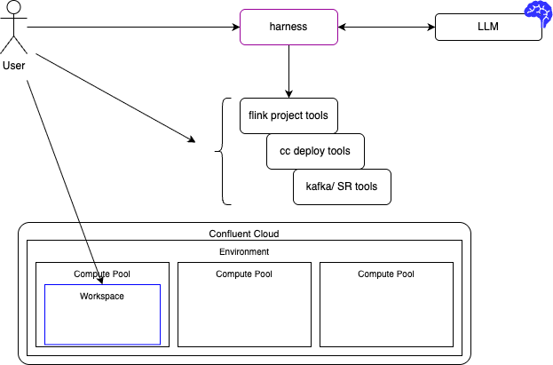

# Flink Tools for Agents

Reusable CLI tools and Bob/Claude agent skills for managing Confluent Cloud Flink projects, SQL statements, dbt confluent projects, and Kafka on Confluent Cloud.

User may interact with an existing AI harness like Claude Code, Codex, IBM Bob, Pi.dev, Cursor... which itself calls LLM models. The tools exposed to the harness are also directly callable by a human. 



Those tools are in three groups: 

1. flink project management (using Confluent dbt), 
1. Confluent cloud deployment (using sql-confluent library),
1.  Kafka/schema registry tools for development practices around schema and tests.

This repository includes tool implementation, LLM skill definitions and how data engineers may use those, with or without AI harness.

## Quick Start For Developers

When enhancing the code within this repository, here are some basic commands:

```bash
# Install all domains
uv sync --extra all --extra dev

# Verify entry points
uv run flink-sql-deploy --help
uv run flink-sql-manifest --help
uv run flink-sql-migrate-dbt --help
uv run sl-dbt --help
uv run flink-sql-cleanup --help
uv run flink-sql-register --help
```

## Quick Start for Data Engineer

See the [Data engineer day to day practice](./methodology/index.md)

## Domains

- [Flink Deploy](flink/index.md) — deploy/undeploy Flink SQL statements, snapshot & streaming queries using [python confluent-sql]()
- [Manifest](manifest/index.md) — generate deployment manifests from SQL dirs or dbt projects
- [dbt flink project management](dbt/index.md) — convert Flink DML to dbt models, scaffold and manage Flink projects
- [Kafka & Schema Registry](kafka/index.md) — register schemas, manage topics and Flink tables

## Using the Skills

See [Skills for Bob/Claude](skills/index.md) for instructions on installing and using the agent skills.

