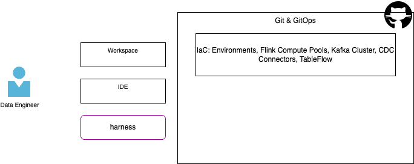

# Day to day activities for a Data Engineer with the AI agents

As introduced in the [methodology chapter](https://jbcodeforce.github.io/flink-studies/methodology/data_eng_101/), the data engineers have a lot to address during the life of a data streaming processing project. This chapter maps those activities to the tools within this repository and the agent skills to potentially use within an AI harness.

This chapter is structured by use cases, and the other descriptions in this documentation may go deeper in the command references.

The acronymes used are:

| Acronym/Term | Definition |
| ---- | ----- |
| **DSP** | Data Streaming Project. Groups Kafka, schema registry, Flink processing and Tableflow | 

## Components Involved

A Confluent Cloud Data Streaming Processing project includes the following components:



* Some are managed by Site Reliability Engineers using infrastructure as code.
* Most of the streaming logic implementations is done using Flink, and other queries mechanisms

## Create a DSP Project

* Create a project directory:
    ```sh
    mkdir $HOME/dsp-project
    cd $HOME/dsp-project
    git init
    ```
* Start your harness CLI or IDE (IBM Bob). If you use an IDE, load the project in your workspace.
* Execute a prompt in your agent harness or run a command:

    | Agent prompt | using /dbt-project create a dbt project under current folder.  use data as a product structure |
    | -----| ---- |
    | **Command** | `uv run sl-dbt init $HOME/dsp-project --type data-product --profile cc_flink`  | 

## Define / update user's .dbt/profiles.yml

The `.dbt/profiles.yml` is created when running `dbt init`. But it is possible to reuse connection definition without running this command each time. As an example the `profile.yml` include the ``cc_flink` connection as:

```yaml
cc_flink:
  outputs:
    dev:
      cloud_provider: aws
      cloud_region: us-west-2
      compute_pool_id: lfcp-1
      dbname: j9r-kafka
      environment_id: '{{ env_var(''ENVIRONMENT_ID'') }}'
      execution_mode: streaming_query
      flink_api_key: '{{ env_var(''FLINK_API_KEY'') }}'
      flink_api_secret: '{{ env_var(''FLINK_API_SECRET'') }}'
      organization_id: '{{ env_var(''ORGANIZATION_ID'') }}'
      statement_label: dbt-confluent
      statement_name_prefix: dbt-
      threads: 1
      type: confluent
  target: dev
```

This can be reused between project, as each `dbt_project.yml` references `profile: 'cc_flink'`

## Manage Flink elements

### Add data product

Data product will help to group Flink pipelines related to the same appplication, same analytics metrics. 

* Execute a prompt in your agent harness or run a command:

    | Agent prompt | add a data analytics product named crm in this project |
    | -----| ---- |
    | **Command** | `uv run sl-dbt sl-dbt add-data-product .$HOME/dsp-project crm  | 

### Add table to a data product

| Agent prompt | add a table to deduplicate raw customer in sources, name it: src_customers for the crm data product |
| -----| ---- |
| **Command** | `uv run sl-dbt sl-dbt  add-table .$HOME/dsp-project crm --table-type source |

### Create raw topics

To prepare dbt run, the sources is referencing exising kafka topics. Sometime, for demonstration purpose, or the topic is not yet available in the kafka cluster. 

| Agent prompt | add a raw topic named raw_customers in the project as raws |
| -----| ---- |
| **Command** | `uv run sl-dbt add-raw-topic $HOME/dsp-project raw_customers`|

Then deploy the raw table

| Agent prompt | add a raw topic named raw_customers in the project as raws |
| -----| ---- |
| **Command** | `uv run flink-sql-deploy --sql-dir $HOME/dsp-project/pipelines/raws deploy` |


### Create a Flink Statement

The steps may looks like:

1. Create the first version of the query in Confluent Cloud Workspace. This is relevant to get access to real data and be able to discover - prepare - validate the SQL query syntax and results. In this form data engineers use SELECT ... statement. As an example we want to deduplicate some raw_customers data. 
    ```sql
    WITH ranked_customers AS (
        SELECT
            *,
            ROW_NUMBER() OVER (
                PARTITION BY customer_id
                ORDER BY updated_at DESC
            ) AS rn
        FROM {{ source('raws', 'raw_customers') }}
        WHERE customer_id IS NOT NULL
    )
    SELECT
        customer_id,
        updated_at,
        first_name,
        last_name,
        email,
        created_at
    FROM ranked_customers
    WHERE rn = 1
    ```

1. Save to disk and visible in IDE
    ```sh
    dsp-project
    ├── docs
    ├── IaC
    ├── pipelines
    ├── tmp-flink
    │   └── src_customers.yml
    ```

1. Run the migration to dbt from this file:
    ```sh
    uv run 
    ```